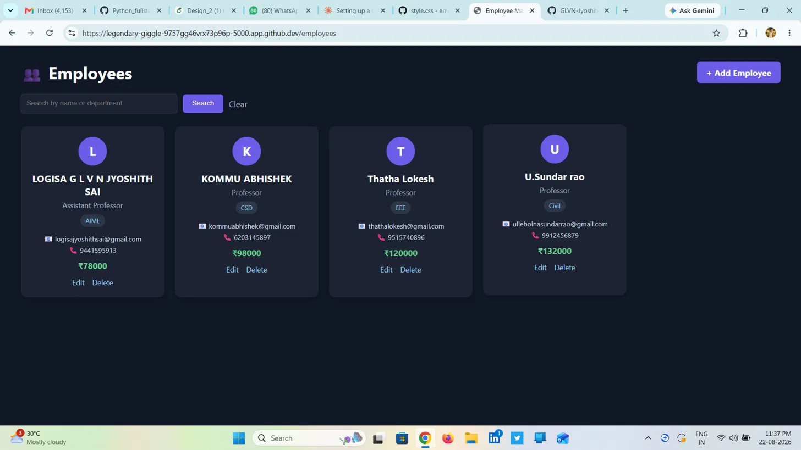
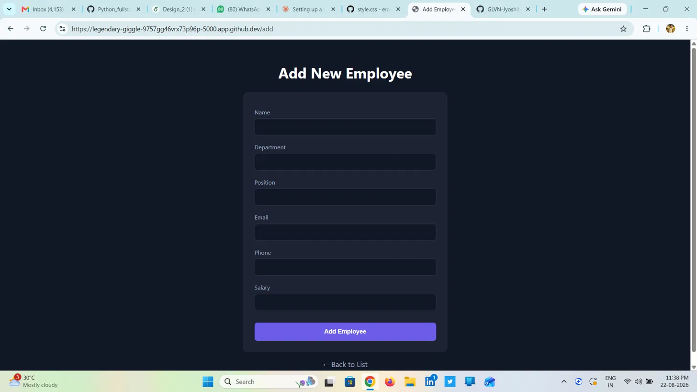
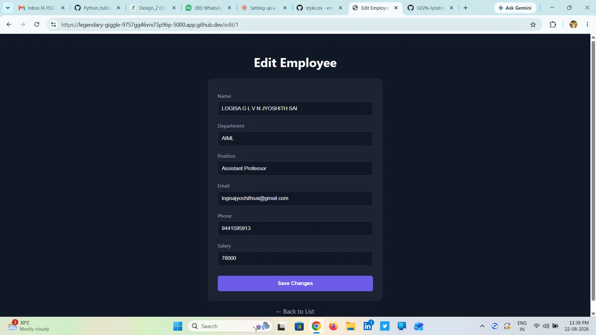

# Employee Management System

A web application to manage employee records, built with Python and Flask, featuring a dark-themed, card-based UI instead of a traditional table layout.

## Features

- Add new employees (name, department, position, email, phone, salary)
- View all employees as styled cards with avatar initials
- Edit employee details
- Delete employees
- Search employees by name or department

## Tech Stack

- Backend: Python, Flask
- Database: SQLite with Flask-SQLAlchemy
- Frontend: HTML, CSS (dark theme, card grid layout), Jinja2 templating

## How to Run Locally

1. Clone the repository:
   git clone https://github.com/<your-username>/employee-management-system.git
   cd employee-management-system

2. Install dependencies:
   pip install -r requirements.txt

3. Run the app:
   python3 app.py

4. Open your browser at http://localhost:5000

## Screenshots

## Future Improvements

- Filter employees by department
- Export employee data to CSV
- Admin login and access control

## Usage Terms

-Free to use, just give me credit, don't blame me if it breaks.